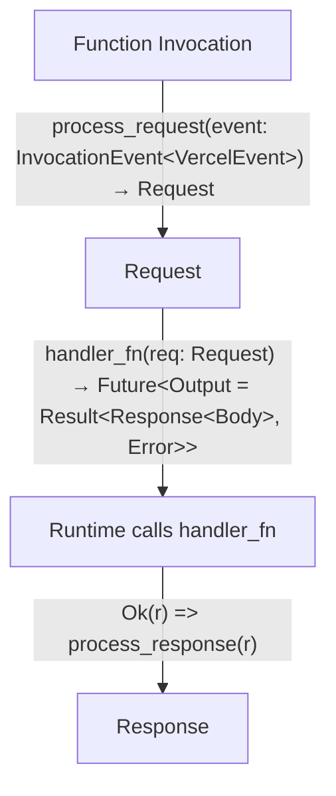

<p align="center">
  <a align="center" href="https://vercel.com">
    
    <h3 align="center">Rust</h3>
  </a>
  <p align="center">Rust Runtime for Vercel Functions.</p>
</p>

<div align="center">

<a href="https://www.npmjs.com/package/vercel-rust"></a>
<a href="https://www.npmjs.com/package/vercel-rust"></a>
<a href="https://crates.io/crates/vercel_runtime"></a>

Community-maintained package to support using [Rust](https://www.rust-lang.org/) inside [Vercel Functions](https://vercel.com/docs/serverless-functions/introduction) as a [Runtime](https://vercel.com/docs/runtimes).

</div>

## Getting Started

> Please ensure [Vercel CLI](https://vercel.com/docs/cli#installing-vercel-cli) and the Rust toolchain is already installed on your system. We recommended setting up Rust with [rustup](https://rustup.rs/).

[Prefer looking at examples?](https://github.com/vercel-community/rust/tree/main/examples)

**Step 1** — Add a `vercel.json` file to your project.

```json
{
  "functions": {
    "api/**/*.rs": {
      "runtime": "vercel-rust@4.0.8"
    }
  }
}
```

This turns every file matching `api/**/*.rs` into a Vercel Function.

> **Note:** The npm dependency `vercel-rust` defined in [functions](https://vercel.com/docs/concepts/projects/project-configuration#functions) **does not** have to be installed manually.

**Step 2** — Create a function. As an example, here is `api/handler.rs`.

```rust
use serde_json::json;
use vercel_runtime::{run, Body, Error, Request, Response, StatusCode};

#[tokio::main]
async fn main() -> Result<(), Error> {
    run(handler).await
}

pub async fn handler(_req: Request) -> Result<Response<Body>, Error> {
    Ok(Response::builder()
        .status(StatusCode::OK)
        .header("Content-Type", "application/json")
        .body(
            json!({
              "message": "你好，世界"
            })
            .to_string()
            .into(),
        )?)
}
```

**Step 3** — Create a `Cargo.toml` in the root directory of your project.

```toml
[package]
name = "my-vercel-api"
version = "0.1.0"
edition = "2021"

[dependencies]
tokio = { version = "1", features = ["macros"] }
serde_json = { version = "1", features = ["raw_value"] }
# Documentation: https://docs.rs/vercel_runtime/latest/vercel_runtime
vercel_runtime = { version = "1" }

# You can specify a library for shared logic here (optional)
# [lib]
# path = "src-rs/lib.rs"

# Each handler has to be specified as [[bin]]
[[bin]]
name = "handler"
path = "api/handler.rs"

# Note that you need to provide unique names for each binary:
# [[bin]]
# name = "user-id"
# path = "api/user/[id].rs"
#
# [[bin]]
# name = "group-id"
# path = "api/group/[id].rs"
```

**Step 4** — Create a `.vercelignore` in the root directory of your project to ignore build artifacts.

```shell
target/
```

**Step 5** — You're all set. Run `vercel dev` to develop your project locally. You can connect a Git repository to Vercel, or use `vercel` to start deploying your project on Vercel.

## Advanced Usage

### Toolchain Overrides

An example on how this can be achieved is using a `rust-toolchain` file adjacent to your `Cargo.toml`. Please refer to [Rust Documentation](https://rust-lang.github.io/rustup/overrides.html#the-toolchain-file) for more details.

### Dependencies

By default builder module supports installing dependencies defined in the `Cargo.toml` file.

More system dependencies can be installed at build time with the presence of a shell `build.sh` file in the root directory of your project.

### Prebuilt Deployments

When creating a prebuilt deployment, the build output must be for `x86_64 linux`. To do this, create a Cargo build configuration at `.cargo/config.toml` with the following contents:

```toml
[build]
target = "x86_64-unknown-linux-musl"

# Uncomment below to support Rust cross-compilation from macOS to Linux
# Follow these installation instructions: https://github.com/chinedufn/cross-compile-rust-from-mac-to-linux
# [target.x86_64-unknown-linux-musl]
# linker = "x86_64-unknown-linux-gnu-gcc"
```

You then can build the file and trigger the deployment via [Vercel CLI](https://vercel.com/docs/cli#installing-vercel-cli).

```shell
vercel build && vercel deploy --prebuilt
```

### Musl/Static linking

Unfortunately, the AWS Lambda Runtime for Rust relies (tangentially) on `proc_macro`, which won't compile on musl targets. Without `musl`, all linking must be dynamic. If you have a crate that relies on system libraries like `postgres` or `mysql`, you can include those library files with the `includeFiles` config option and set the proper environment variables, config, etc. that you need to get the library to compile.

For more information, please see [this issue](https://github.com/mike-engel/vercel-rust/issues/2).

### Experimental API Bundling

This feature allows you to bundle all of your routes into _a single_ deployed Vercel function.
This serves to optimize cold starts, as lambda functions are reused as much as possible.
In addition, this has the benefit of only needing to annotate a single `[[bin]]` in your `Cargo.toml`.

To enable this behaviour, take the following steps:

**Step 1** — Create a `api/main.rs`.

```rust
use vercel_runtime::{bundled_api, run, Body, Error, Request, Response};

#[tokio::main]
async fn main() -> Result<(), Error> {
    run(handler).await
}

// The proc macro `bundled_api` injects a router for all `api/**/*.rs` handler files .
// If you are using cargo workspaces (like `examples/route-merge` in this repository),
// then an additional `path` argument must be passed to the macro. E.g.
// #[bundled_api( path = "examples/route-merge" )]
#[bundled_api]
pub async fn handler(req: Request) -> Result<Response<Body>, Error> {}
```

**Step 2** — Change your `vercel.json` to only specify your `api/main.rs` file.

```json
{
  "functions": {
    "api/main.rs": {
      "runtime": "vercel-rust@4.0.8"
    }
  }
}
```

**Step 3** — Change your `Cargo.toml` to specify the binary for `main.rs`.

```toml
[[bin]]
name = "main"
path = "api/main.rs"
```

**Step 4** — Add a `handler` function to each route in `api/**`.

```rust
// Example api/foo.rs
use vercel_runtime::{Body, Error, Request, Response, StatusCode};

pub async fn handler(_req: Request) -> Result<Response<Body>, Error> {
    Ok(Response::builder()
        .status(StatusCode::OK)
        .header("Content-Type", "application/json")
        .body(Body::Text("Route is /api/foo".into()))?)
}
```

## Contributing

Since this project contains both Rust and Node.js code, you need to install the relevant dependencies. If you're only working on the TypeScript side, you only need to install those dependencies (and vice-versa).

```shell
# install node dependencies
pnpm install

# install cargo dependencies
cargo fetch
```

### Builder Module

The _npm_ module `vercel-rust` is implementing an interface which is primarily taking care of spawning a development server, caching between consecutive builds, and running the compilation. You can read more about the in-depths of implementing a builder [here](https://github.com/vercel/vercel/blob/main/DEVELOPING_A_RUNTIME.md).

### Runtime Crate

The crate `vercel_runtime` is what you will consume in your Rust functions. As the name suggests, the runtime crate takes care of everything that happens during run-time. In specific it takes care of creating a [Tower](https://docs.rs/tower/latest/tower/trait.Service.html) service, which expects a specific handler signature. The flow of an invocation can be visualized as the following:



### Macro Crate

The crate `vercel_runtime_macro` enables supporting our API bundling feature. This procedural macro matches all `api/**/*.rs` routes, imports their respective handlers, and injects router logic to call the correct handlers during runtime.

### Router Crate

The crate `vercel_runtime_router` contains routing logic that is injected for our API bundling feature.

## Legacy Runtime

If you are looking for the legacy runtime instructions using `vercel_lambda` see [tree/a9495a0](https://github.com/vercel-community/rust/tree/a9495a0f0d882a36ea165f1629fcc79c30bc3108).
