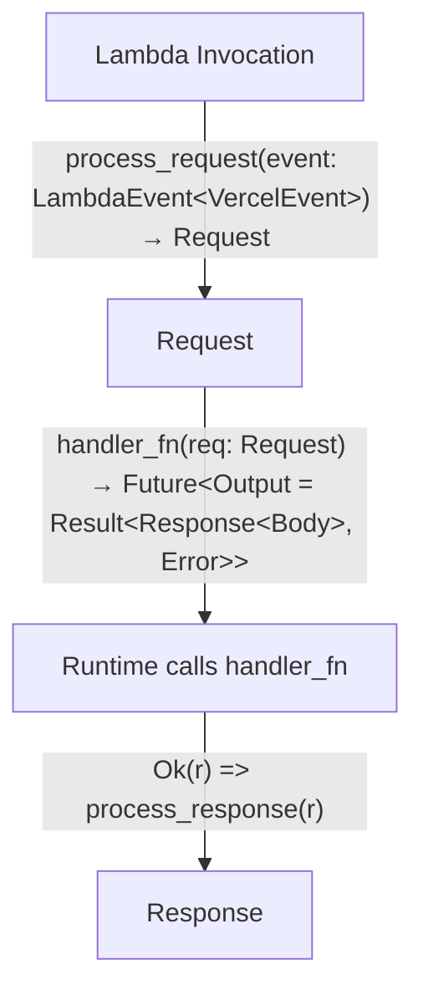

<p align="center">
  <a href="https://vercel.com">
    
    <h3 align="center">Rust</h3>
  </a>
  <p align="center">Rust runtime for Vercel Functions.</p>
</p>

Community-maintained package to support using [Rust](https://www.rust-lang.org/) inside [Vercel Functions](https://vercel.com/docs/serverless-functions/introduction) as a [Runtime](https://vercel.com/docs/runtimes).

## Legacy Runtime

The below documentation is for the `vercel_runtime` crate (in beta). If you are looking for the legacy runtime instructions using `vercel_lambda` see [tree/a9495a0](https://github.com/vercel-community/rust/tree/a9495a0f0d882a36ea165f1629fcc79c30bc3108).

## Usage

First, you'll need a `vercel.json` file in your project:

```json
{
  "functions": {
    "api/**/*.rs": {
      "runtime": "vercel-rust@4.0.0-beta.2"
    }
  }
}
```

A Vercel Function will be created for every file that matches `api/**/*.rs`.

Example:

```rust
use serde_json::json;
use vercel_runtime::{run, Body, Error, Request, Response, StatusCode};

#[tokio::main]
async fn main() -> Result<(), Error> {
    run(handler).await
}

pub async fn handler(_req: Request) -> Result<Response<Body>, Error> {
    Ok(Response::builder()
        .status(StatusCode::OK)
        .header("Content-Type", "application/json")
        .body(
            json!({
              "message": "你好，世界"
            })
            .to_string()
            .into(),
        )?)
}
```

Finally we need a `Cargo.toml` file at the root of your repository.

```toml
# --snip--

[dependencies]
# --snip--
# Documentation: https://docs.rs/vercel_runtime/latest/vercel_runtime
vercel_runtime = { version = "0.2.1" }

# You can specify a library for shared logic here (optional)
# [lib]
# path = "src-rs/lib.rs"

# Each handler has to be specified as [[bin]]
[[bin]]
name = "handler"
path = "api/handler.rs"

# Note that you need to provide unique names for dynamic paths
[[bin]]
name = "user-id"
path = "api/user/[id].rs"

[[bin]]
name = "group-id"
path = "api/group/[id].rs"


# --snip--
```

### Dependencies

This Builder supports installing dependencies defined in the `Cargo.toml` file.

Furthermore, more system dependencies can be installed at build time with the presence of a shell `build.sh` file in the same directory as the entrypoint file.

## Local Development

With `vercel dev` and `vercel-rust`, you can develop your Rust-based lambdas on your own machine.

During local development with `vercel dev`, ensure `rust` and `cargo` are already installed and available in your `PATH`, since they will not be installed automatically. The recommended way to install is with [rustup](https://rustup.rs/).

## Contributing

Since this project contains both Rust and Node.js code, you need to install the relevant dependencies. If you're only working on the JavaScript side, you only need to install those dependencies (and vice-versa).

```shell
# install node dependencies
pnpm install


# install cargo dependencies
cargo fetch
```

## Invocation Flowchart



## FAQ

<details>
  <summary>Can I use musl/static linking?</summary>
  
Unfortunately, the AWS Lambda Runtime for Rust relies (tangentially) on `proc_macro`, which won't compile on musl targets. Without `musl`, all linking must be dynamic. If you have a crate that relies on system libraries like `postgres` or `mysql`, you can include those library files with the `includeFiles` config option and set the proper environment variables, config, etc. that you need to get the library to compile.

For more information, please see [this issue](https://github.com/mike-engel/vercel-rust/issues/2).

</details>
